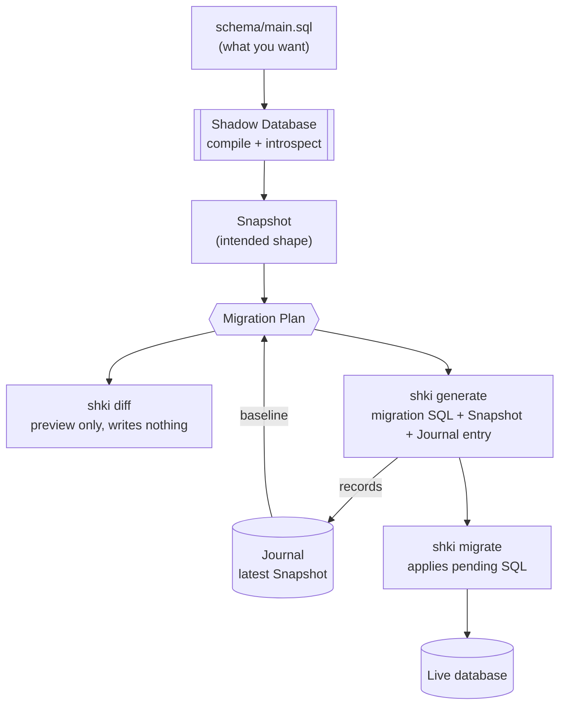

Most migration tools ask you to write the *change*. `shki` asks you to write the
*destination* — the schema you want — and works out the change by comparing that
destination to what it already knows about your database's history.

## The pieces

| Term                   | What it is                                                                                                      |
| ---------------------- | --------------------------------------------------------------------------------------------------------------- |
| **Declarative Schema** | SQL you author and commit describing the intended shape: `CREATE TABLE`, `CREATE INDEX`, extensions, and so on. |
| **Shadow Database**    | A disposable PostgreSQL instance where the Declarative Schema is executed so it can be introspected.            |
| **Snapshot**           | A JSON record of a database shape, captured by introspecting the Shadow Database.                               |
| **Journal**            | `migrations/_meta/_journal.json` — the ordered index relating each migration to its Snapshot.                   |
| **Migration Plan**     | The object-level change set computed by diffing two Snapshots.                                                  |
| **Custom Migration**   | Hand-written SQL for anything the Declarative Schema can't express (backfills, operational SQL).                |

## The loop



Two things follow from this design:

* **Your live database is never the source of truth for generation.** The
  baseline is the last committed Snapshot, so `diff` and `generate` are
  deterministic and work offline, without touching production.
* **The Shadow Database is disposable and reset before use.** It exists only to
  turn SQL text into an introspectable shape. By default `shki` manages an
  embedded PostgreSQL, so there is nothing to install or provision.

## What lands on disk

```text
db/
  shki.toml
  postgres-language-server.jsonc      # PostgreSQL projects: editor tooling config
  schema/
    main.sql                          # Declarative Schema entrypoint
  migrations/
    0000_create_users.sql             # applied in order by `shki migrate`
    0000_create_users.down.sql        # optional Down Migration
    _meta/
      0000_create_users.snapshot.json # shape after this migration
      _journal.json                   # ordered index of migrations -> Snapshots
```

All of it is committed. A checkout plus `shki migrate` is enough to build the
database from nothing; a checkout plus `shki diff` is enough to see what the next
migration would do.

## Where Custom Migrations fit

Custom Migrations sit in the same ordered list and are recorded in the Journal,
but their SQL isn't known when they're created, so no Snapshot is written then.
The next time a diff is needed, `shki` replays any not-yet-snapshotted migrations
on the Shadow Database, introspects the result, and records a Snapshot for each.
That keeps the chain complete: a schema change made by hand becomes part of the
baseline, so the next generated migration won't re-emit DDL that already ran.

## Migrations vs. the live database

`shki migrate` records each applied migration and its checksum in a migrations
table (`shki.__shki_migrations` by default). That table is what `status` reads to
report pending work and to warn when an applied migration's file has changed
since it ran. `migrate` never edits local Snapshots or the Journal — generation
and application are separate concerns.

Next: [Quick Start](../../getting-started/quick-start/) to run the loop, or
[Declarative Schema](../../guides/declarative-schema/) for the authoring rules.
